# <div align="center">🌐 **R I C H E B Y T E** 🌐</div>

<div align="center">


<div align="center">

[](https://github.com/RicheByte) [](https://github.com/RicheByte) [](https://github.com/RicheByte)

 [](https://github.com/RicheByte)

</div>

---

##  **SYSTEM INITIALIZATION**

```
╔══════════════════════════════════════════════════════════════════╗
║  [████████████████████████████████████████████████████████] 100% ║
║                                                              ║
║  > LOADING CONSCIOUSNESS MATRIX...........................   ║
║  > ESTABLISHING SECURE CONNECTIONS........................   ║
║  > DEPLOYING ETHICAL PROTOCOLS...........................    ║
║  > INITIALIZING CYBER DEFENSE SYSTEMS....................   ║
║                                                              ║
║        "In a world of vulnerabilities,                      ║
║         be the exploit they never saw coming."              ║
║                                                              ║
║                        - RicheByte                          ║
╚══════════════════════════════════════════════════════════════════╝
```

<div align="center">  </div>

---

## 🔥 **NEURAL ARCHITECTURE**

<table> <tr> <td width="50%" valign="top">

### 🧠 **CORE PROCESSING UNIT**

```rust
struct RicheByte {
    mindset: CyberGuardian,
    specialization: EthicalHacker,
    mission: DefendTheDigitalRealm,
    power_level: Over9000,
}

impl RicheByte {
    fn hack_ethically(&self) -> SecurityImprovement {
        self.find_vulnerabilities()
            .analyze_threats()
            .develop_countermeasures()
            .share_knowledge()
    }
}
```

</td> <td width="50%" valign="top">

### ⚡ **SYSTEM CAPABILITIES**

```python
class DigitalPhantom:
    def __init__(self):
        self.skills = {
            "penetration_testing": "MASTER",
            "vulnerability_assessment": "EXPERT", 
            "digital_forensics": "ADVANCED",
            "reverse_engineering": "PROFICIENT",
            "code_analysis": "NINJA_LEVEL"
        }
        
    def execute_mission(self):
        while True:
            self.scan_for_threats()
            self.fortify_defenses()
            self.educate_community()
```

</td> </tr> </table>

---

## 🛡️ **DIGITAL ARSENAL**

<div align="center">

### **PROGRAMMING LANGUAGES**

      

### **HACKING TOOLKIT**

     

### **OPERATING SYSTEMS**

   

</div>

---

## 📊 **NEURAL NETWORK STATISTICS**

<div align="center">   </div> <div align="center">  </div> <div align="center">  </div>

---

## 🎭 **ACTIVE OPERATIONS**

```mermaid
graph TB
    A[🔍 Vulnerability Research] --> B[🛠️ Exploit Development]
    B --> C[🛡️ Defense Mechanisms]
    C --> D[📚 Knowledge Transfer]
    D --> E[🌐 Community Building]
    E --> F[🎓 Education & Training]
    F --> A
    
    G[💻 Code Analysis] --> H[🔐 Security Auditing]
    H --> I[📊 Threat Intelligence]
    I --> J[🚨 Incident Response]
    J --> G
    
    style A fill:#00ff41,stroke:#000,stroke-width:3px,color:#000
    style B fill:#ff6600,stroke:#000,stroke-width:3px,color:#fff
    style C fill:#0080ff,stroke:#000,stroke-width:3px,color:#fff
    style D fill:#ff0080,stroke:#000,stroke-width:3px,color:#fff
    style E fill:#8000ff,stroke:#000,stroke-width:3px,color:#fff
    style F fill:#ffff00,stroke:#000,stroke-width:3px,color:#000
    style G fill:#ff4000,stroke:#000,stroke-width:3px,color:#fff
    style H fill:#40ff00,stroke:#000,stroke-width:3px,color:#000
    style I fill:#0040ff,stroke:#000,stroke-width:3px,color:#fff
    style J fill:#ff0040,stroke:#000,stroke-width:3px,color:#fff
```

<div align="center">



</div>

### 🚀 **CURRENT MISSIONS**

<table> <tr> <td width="33%">

#### 🔐 **PROJECT: GHOST PROTOCOL**

- Advanced steganography tools
- Zero-day research framework
- Automated vulnerability scanner
- **Status:** `CLASSIFIED` 🤐

</td> <td width="33%">

#### 🛡️ **PROJECT: DIGITAL FORTRESS**

- Next-gen firewall architecture
- AI-powered threat detection
- Blockchain security protocols
- **Status:** `IN DEVELOPMENT` ⚡

</td> <td width="33%">

#### 🎓 **PROJECT: KNOWLEDGE MATRIX**

- Cybersecurity education platform
- Interactive hacking simulations
- Community-driven CTF challenges
- **Status:** `BETA TESTING` 🧪

</td> </tr> </table>

---

## 💀 **THE HACKER'S CREED**

<div align="center">

```
    ╔══════════════════════════════════════════════════════════════╗
    ║                                                              ║
    ║    ██╗  ██╗ █████╗  ██████╗██╗  ██╗███████╗██████╗          ║
    ║    ██║  ██║██╔══██╗██╔════╝██║ ██╔╝██╔════╝██╔══██╗         ║
    ║    ███████║███████║██║     █████╔╝ █████╗  ██████╔╝         ║
    ║    ██╔══██║██╔══██║██║     ██╔═██╗ ██╔══╝  ██╔══██╗         ║
    ║    ██║  ██║██║  ██║╚██████╗██║  ██╗███████╗██║  ██║         ║
    ║    ╚═╝  ╚═╝╚═╝  ╚═╝ ╚═════╝╚═╝  ╚═╝╚══════╝╚═╝  ╚═╝         ║
    ║                                                              ║
    ║  💻 Code by day, deep thoughts by night                      ║
    ║  🔍 Always curious, never malicious                          ║
    ║  🛡️ Protect the digital realm at all costs                  ║
    ║  ⚡ Break systems to make them unbreakable                   ║
    ║  🌐 Share knowledge, build community                         ║
    ║  🎯 Ethical hacking is the ultimate art form                 ║
    ║                                                              ║
    ╚══════════════════════════════════════════════════════════════╝
```

</div>

---

## 🌐 **ESTABLISH CONNECTION**

<div align="center">

### **SECURE CHANNELS**

[](https://github.com/RicheByte) [](https://linkedin.com/in/richebyte) [](https://twitter.com/richebyte) [](https://discord.gg/richebyte) [](https://t.me/richebyte)

### **COMMUNITY HUBS**

[](https://hackthebox.com/) [](https://tryhackme.com/) [](https://bugcrowd.com/)

</div>

---

## 🎮 **SYSTEM DIAGNOSTICS**

<div align="center">

### **CURRENT STATUS**

```javascript
const systemStatus = {
    🔋 energy: "MAXIMUM_OVERDRIVE",
    🧠 creativity: "NEURAL_OVERFLOW", 
    ☕ coffee: "CRITICALLY_LOW",
    🔥 passion: "BURNING_BRIGHT",
    🎯 focus: "LASER_PRECISION",
    💡 ideas: "INFINITE_STREAM"
};

while(universe.exists()) {
    learn(everything);
    hack(ethically);
    protect(innocents);
    share(knowledge);
    build(community);
    drink(coffee);
}
```

</div>

---

<div align="center"> 

### 💀 **"The best defense is a good offense, ethically applied"** 💀

**`REMEMBER: With great power comes great responsibility`**

 </div>
