# 🌐 RicheByte | Digital Guardian & Code Architect

<div align="center">
  
</div>

<div align="center">
  
  [](https://github.com/RicheByte)
  
  
  
</div>

---

## 🎭 The Digital Phantom

```ascii
    ┌─────────────────────────────────────┐
    │  "In a world of vulnerabilities,    │
    │   be the exploit they never         │
    │   saw coming."                      │
    │                                     │
    │           - RicheByte               │
    └─────────────────────────────────────┘
```

<div align="center">
  
</div>

## ⚡ Core Systems

<table>
  <tr>
    <td valign="top" width="50%">

### 🛡️ Security Arsenal
```javascript
const securityExpert = {
    specialization: "Cybersecurity & Ethical Hacking",
    philosophy: "Breaking barriers, not systems",
    approach: "Defense through understanding offense",
    mindset: "Think like an attacker, defend like a guardian"
};
```

    </td>
    <td valign="top" width="50%">

### 🧠 Neural Networks
```python
class RicheByte:
    def __init__(self):
        self.skills = ["Penetration Testing", "Vulnerability Assessment", 
                      "Code Analysis", "Digital Forensics"]
        self.mode = "Always Learning"
        self.threat_level = "Benevolent"
```

    </td>
  </tr>
</table>

## 🔥 Tech Stack Matrix

<div align="center">

### Languages & Frameworks


### Security Tools


### Development Environment


</div>

## 📊 System Metrics

<div align="center">
  
  
</div>

<div align="center">
  
</div>

## 🎯 Current Operations

```mermaid
graph TD
    A[🔍 Vulnerability Research] --> B[🛠️ Tool Development]
    B --> C[📚 Knowledge Sharing]
    C --> D[🌐 Community Building]
    D --> A
    
    style A fill:#00ff41,stroke:#000,color:#000
    style B fill:#ff6600,stroke:#000,color:#fff
    style C fill:#0080ff,stroke:#000,color:#fff
    style D fill:#ff0080,stroke:#000,color:#fff
```

<div align="center">



</div>

### 🚀 Active Projects
- 🔐 **Security Framework Development** - Building robust defense mechanisms
- 📝 **Vulnerability Documentation** - Sharing knowledge with the community  
- 🎓 **Educational Content Creation** - Teaching ethical hacking principles
- 🌐 **Open Source Contributions** - Strengthening the security ecosystem

## 💀 Hacker Manifesto

<div align="center">

```
╔═══════════════════════════════════════╗
║  💻 Code by day, deep thoughts by night  ║
║  🔍 Always curious, never malicious      ║
║  🛡️ Protect the digital realm           ║
║  ⚡ Break systems to make them stronger  ║
╚═══════════════════════════════════════╝
```

</div>

## 🌐 Connect to My Network

<div align="center">

[](https://github.com/RicheByte)
[](https://linkedin.com/in/richebyte)
[](https://twitter.com/richebyte)
[](https://discord.gg/richebyte)

</div>

---

<div align="center">
  
  ### 🎮 Fun Fact
  ```javascript
  while(coffee.available()) {
    code();
    hack(ethically);
    learn(continuously);
  }
  ```
  
  
  
</div>

<div align="center">
  <h3>🔥 "The best defense is a good offense, ethically applied" 🔥</h3>
</div>
